# Diagramas de Sequência - App View v2.0
**Fluxos Principais do Sistema**

**Versão:** 2.0.0  
**Data:** Janeiro de 2026  
**Formato:** Mermaid (UML)  

---

## Índice

1. [Fluxo 01: Recepção e Processamento de Sinistro](#fluxo-01-recepção-e-processamento-de-sinistro)
2. [Fluxo 02: Recepção e Processamento de Cliente](#fluxo-02-recepção-e-processamento-de-cliente)
3. [Fluxo 03: Callback de OCR do Jarvis](#fluxo-03-callback-de-ocr-do-jarvis)
4. [Fluxo 04: Roteamento para Pega BPM](#fluxo-04-roteamento-para-pega-bpm)
5. [Fluxo 05: Comunicação via CCM](#fluxo-05-comunicação-via-ccm)
6. [Fluxo 06: Agendamento de Perícia](#fluxo-06-agendamento-de-perícia)
7. [Fluxo 07: Portal PJ - Consulta de Propostas](#fluxo-07-portal-pj---consulta-de-propostas)
8. [Fluxo 08: BOD Seguros - Implantação de Contrato](#fluxo-08-bod-seguros---implantação-de-contrato)
9. [Fluxo 09: Autenticação OAuth 2.0](#fluxo-09-autenticação-oauth-20)
10. [Fluxo 10: Tratamento de Erro com Circuit Breaker](#fluxo-10-tratamento-de-erro-com-circuit-breaker)
11. [Fluxo 11: Processamento Assíncrono via Service Bus](#fluxo-11-processamento-assíncrono-via-service-bus)
12. [Fluxo 12: Geração de Relatórios e Dashboards](#fluxo-12-geração-de-relatórios-e-dashboards)

---

## Fluxo 01: Recepção e Processamento de Sinistro

**Descrição:** Fluxo completo desde a recepção de um documento de sinistro até o processamento OCR e roteamento para Pega.

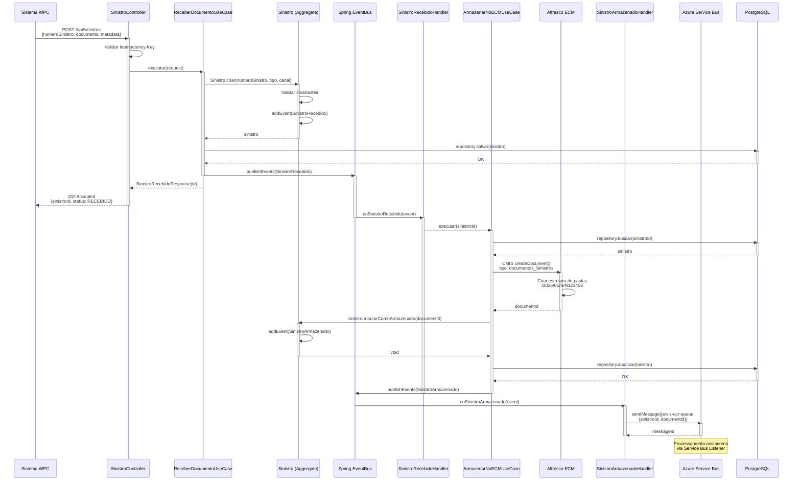

---

## Fluxo 02: Recepção e Processamento de Cliente

**Descrição:** Fluxo de recepção de documentos de cliente (RG, CPF, CNH) com validação OCR.

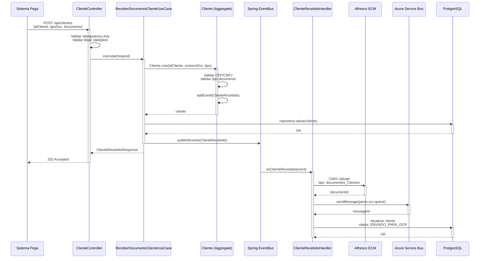

---

## Fluxo 03: Callback de OCR do Jarvis

**Descrição:** Processamento do callback do Jarvis após conclusão da análise OCR.

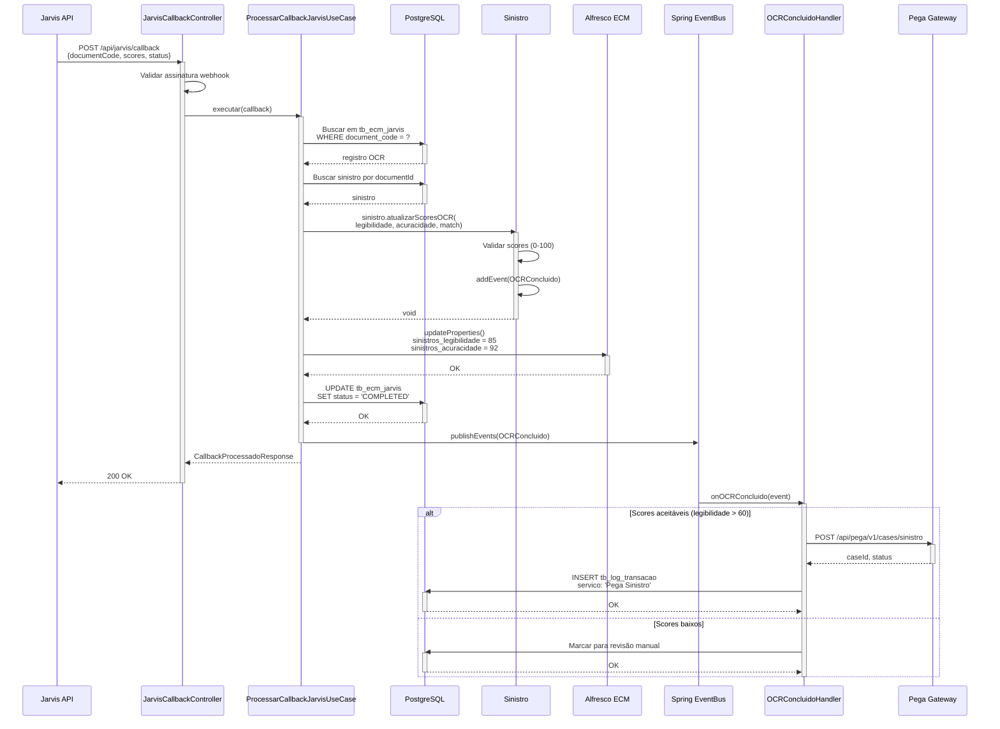

---

## Fluxo 04: Roteamento para Pega BPM

**Descrição:** Criação de caso no Pega após validação OCR bem-sucedida.

```mermaid
sequenceDiagram
    participant Handler as OCRConcluidoHandler
    participant UseCase as RotearParaPegaUseCase
    participant DB as PostgreSQL
    participant Domain as Sinistro
    participant Gateway as PegaGateway
    participant CB as Circuit Breaker
    participant Pega as Pega API
    participant EventBus as Spring EventBus

    Handler->>UseCase: executar(sinistroId)
    activate UseCase
    
    UseCase->>DB: repository.buscar(sinistroId)
    activate DB
    DB-->>UseCase: sinistro
    deactivate DB
    
    UseCase->>UseCase: Montar payload Pega
    
    UseCase->>Gateway: criarCaso(request)
    activate Gateway
    
    Gateway->>CB: Verificar estado
    activate CB
    
    alt Circuit Breaker CLOSED
        CB-->>Gateway: OK para prosseguir
        deactivate CB
        
        Gateway->>Pega: POST /api/pega/v1/cases/sinistro
        activate Pega
        
        alt Sucesso
            Pega-->>Gateway: 201 Created<br/>{caseId, status}
            deactivate Pega
            
            Gateway-->>UseCase: PegaCaseResponse
            deactivate Gateway
            
            UseCase->>Domain: sinistro.marcarComoRoteado(pegaCaseId)
            activate Domain
            Domain->>Domain: addEvent(SinistroRoteadoParaPega)
            Domain-->>UseCase: void
            deactivate Domain
            
            UseCase->>DB: repository.atualizar(sinistro)
            activate DB
            DB-->>UseCase: OK
            deactivate DB
            
            UseCase->>DB: INSERT tb_log_transacao<br/>servico: 'Pega Sinistro'<br/>status: 1 (sucesso)
            activate DB
            DB-->>UseCase: OK
            deactivate DB
            
        else Erro 5xx
            Pega-->>Gateway: 500 Internal Error
            deactivate Pega
            Gateway->>Gateway: Registrar falha no CB
            Gateway-->>UseCase: PegaIndisponivelException
            deactivate Gateway
            
            UseCase->>DB: INSERT tb_log_transacao<br/>status: 2 (falha)
            activate DB
            DB-->>UseCase: OK
            deactivate DB
        end
        
    else Circuit Breaker OPEN
        CB-->>Gateway: Circuit Aberto
        deactivate CB
        Gateway->>Gateway: Fallback
        Gateway-->>UseCase: EnfileirarException
        deactivate Gateway
        
        UseCase->>Queue: sendMessage(pega-retry-queue)
        activate Queue
        Queue-->>UseCase: messageId
        deactivate Queue
    end
    
    UseCase->>EventBus: publishEvents(SinistroRoteadoParaPega)
    deactivate UseCase
```

---

## Fluxo 05: Comunicação via CCM

**Descrição:** Envio de comunicação (email/SMS) ao segurado via sistema CCM.

```mermaid
sequenceDiagram
    participant Handler as SinistroProcessadoHandler
    participant UseCase as NotificarSeguradoUseCase
    participant DB as PostgreSQL
    participant Gateway as CCMGateway
    participant CCM as CCM API
    participant EventBus as Spring EventBus

    Handler->>UseCase: executar(sinistroId, template)
    activate UseCase
    
    UseCase->>DB: Buscar dados do sinistro<br/>e segurado
    activate DB
    DB-->>UseCase: sinistro, segurado
    deactivate DB
    
    UseCase->>UseCase: Montar payload CCM<br/>com template e parâmetros
    
    UseCase->>Gateway: enviarComunicacao(request)
    activate Gateway
    
    Gateway->>CCM: POST /api/ccm/v1/comunicacoes
    activate CCM
    
    alt Sucesso
        CCM->>CCM: Agendar envio<br/>Validar destinatário
        CCM-->>Gateway: 201 Created<br/>{comunicacaoId, status}
        deactivate CCM
        
        Gateway-->>UseCase: ComunicacaoResponse
        deactivate Gateway
        
        UseCase->>DB: INSERT tb_log_transacao<br/>servico: 'CCM'<br/>status: 1
        activate DB
        DB-->>UseCase: OK
        deactivate DB
        
        UseCase->>EventBus: publishEvent(ComunicacaoAgendada)
        
    else Erro - Destinatário Inválido
        CCM-->>Gateway: 422 Unprocessable Entity
        deactivate CCM
        Gateway-->>UseCase: DestinatarioInvalidoException
        deactivate Gateway
        
        UseCase->>DB: Logar erro
        activate DB
        DB-->>UseCase: OK
        deactivate DB
    end
    
    deactivate UseCase
    
    Note over CCM: Processamento assíncrono<br/>Envio de email/SMS<br/>em background
```

---

## Fluxo 06: Agendamento de Perícia

**Descrição:** Agendamento de perícia com prestador após análise inicial do sinistro.

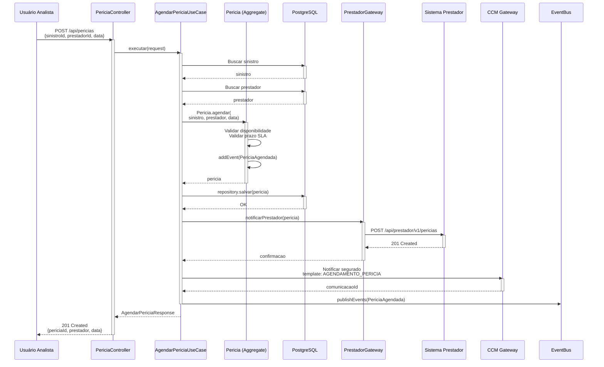

---

## Fluxo 07: Portal PJ - Consulta de Propostas

**Descrição:** Acesso jurídico a propostas e documentação via Portal PJ.

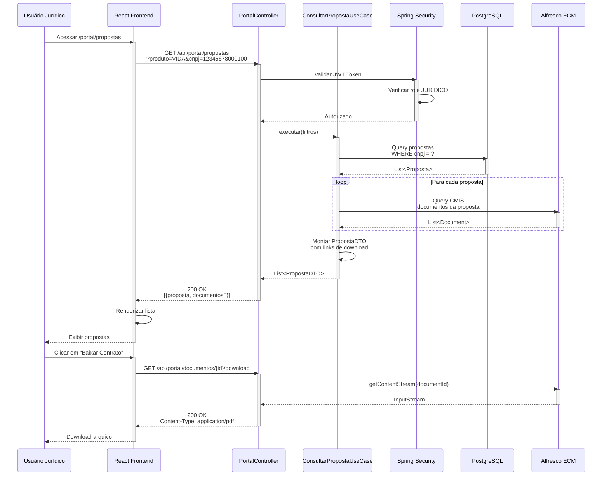

---

## Fluxo 08: BOD Seguros - Implantação de Contrato

**Descrição:** Implantação de novo contrato corporativo no sistema BOD Seguros.

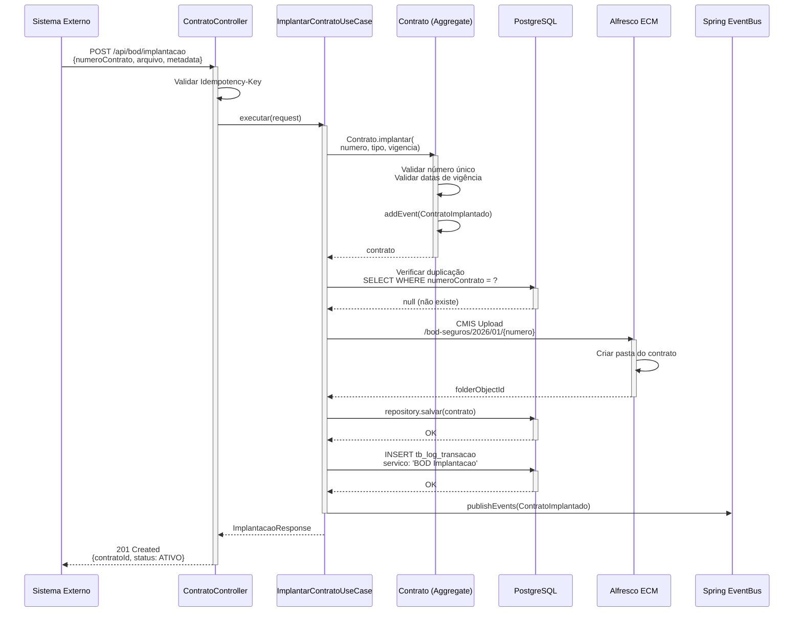

---

## Fluxo 09: Autenticação OAuth 2.0

**Descrição:** Fluxo de autenticação via Azure AD com JWT.

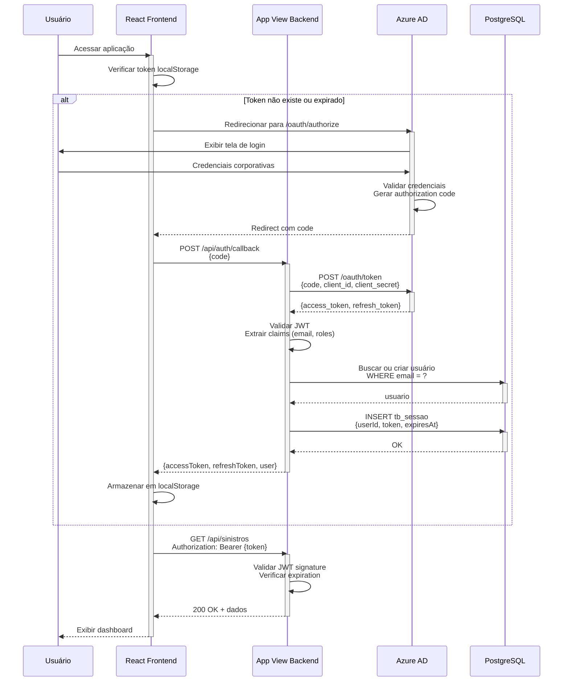

---

## Fluxo 10: Tratamento de Erro com Circuit Breaker

**Descrição:** Comportamento do circuit breaker em caso de falhas sucessivas.

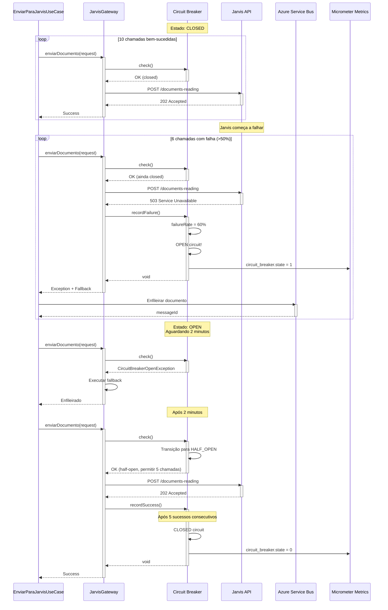

---

## Fluxo 11: Processamento Assíncrono via Service Bus

**Descrição:** Processamento de mensagens da fila para envio ao Jarvis.

```mermaid
sequenceDiagram
    participant Producer as Event Handler
    participant Queue as Azure Service Bus
    participant Listener as Service Bus Listener
    participant UseCase as ProcessarDocumentoJarvisUseCase
    participant DB as PostgreSQL
    participant Gateway as JarvisGateway
    participant Jarvis as Jarvis API

    Producer->>Queue: sendMessage(jarvis-ocr-queue,<br/>{sinistroId, documentId})
    activate Queue
    Queue-->>Producer: messageId
    
    Note over Queue: Mensagem enfileirada<br/>Aguardando processamento

    Queue->>Listener: onMessage(message)
    deactivate Queue
    activate Listener
    
    Listener->>Listener: Extrair payload<br/>Validar messageId (idempotência)
    
    Listener->>UseCase: executar(sinistroId, documentId)
    activate UseCase
    
    UseCase->>DB: Verificar se já processado<br/>WHERE messageId = ?
    activate DB
    DB-->>UseCase: null (não processado)
    deactivate DB
    
    UseCase->>DB: Buscar sinistro e documento
    activate DB
    DB-->>UseCase: sinistro, documento
    deactivate DB
    
    UseCase->>Gateway: enviarDocumento(documento)
    activate Gateway
    
    Gateway->>Jarvis: POST /documents-reading
    activate Jarvis
    
    alt Sucesso
        Jarvis-->>Gateway: 202 Accepted
        deactivate Jarvis
        Gateway-->>UseCase: requestId
        deactivate Gateway
        
        UseCase->>DB: INSERT tb_ecm_jarvis<br/>status: PROCESSING
        activate DB
        DB-->>UseCase: OK
        deactivate DB
        
        UseCase->>DB: Registrar messageId processado
        activate DB
        DB-->>UseCase: OK
        deactivate DB
        
        UseCase-->>Listener: ProcessamentoOK
        deactivate UseCase
        
        Listener->>Queue: complete(message)
        activate Queue
        Queue-->>Listener: OK
        deactivate Queue
        
    else Erro recuperável (5xx)
        Jarvis-->>Gateway: 503 Service Unavailable
        deactivate Jarvis
        Gateway-->>UseCase: JarvisIndisponivelException
        deactivate Gateway
        deactivate UseCase
        
        Listener->>Queue: abandon(message)<br/>incrementar deliveryCount
        activate Queue
        Queue-->>Listener: Re-enfileirado
        deactivate Queue
        
        Note over Queue: Retry automático<br/>após delay
        
    else Erro não recuperável (4xx)
        Jarvis-->>Gateway: 400 Bad Request
        deactivate Jarvis
        Gateway-->>UseCase: PayloadInvalidoException
        deactivate Gateway
        deactivate UseCase
        
        Listener->>Queue: deadLetter(message)
        activate Queue
        Queue-->>Listener: Movido para DLQ
        deactivate Queue
    end
    
    deactivate Listener
```

---

## Fluxo 12: Geração de Relatórios e Dashboards

**Descrição:** Consulta de métricas e geração de relatórios operacionais.

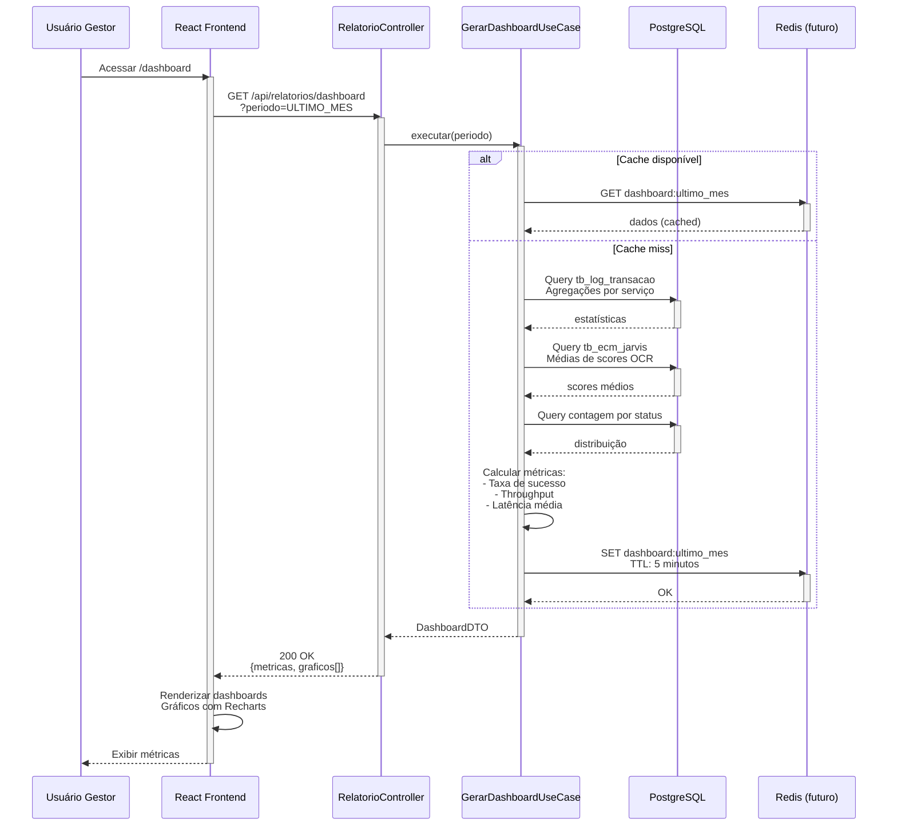

---

## Fluxo 13: Idempotência - Request Duplicado

**Descrição:** Tratamento de request duplicado usando Idempotency-Key.

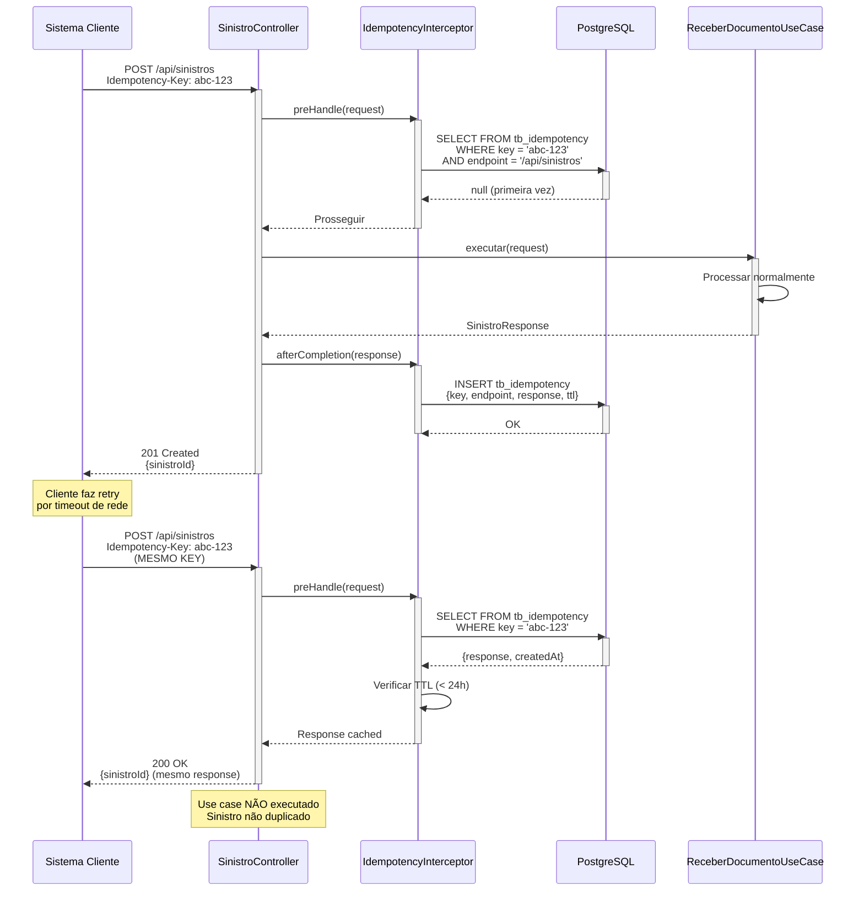

---

## Fluxo 14: Retry com Exponential Backoff

**Descrição:** Política de retry em caso de falha temporária.

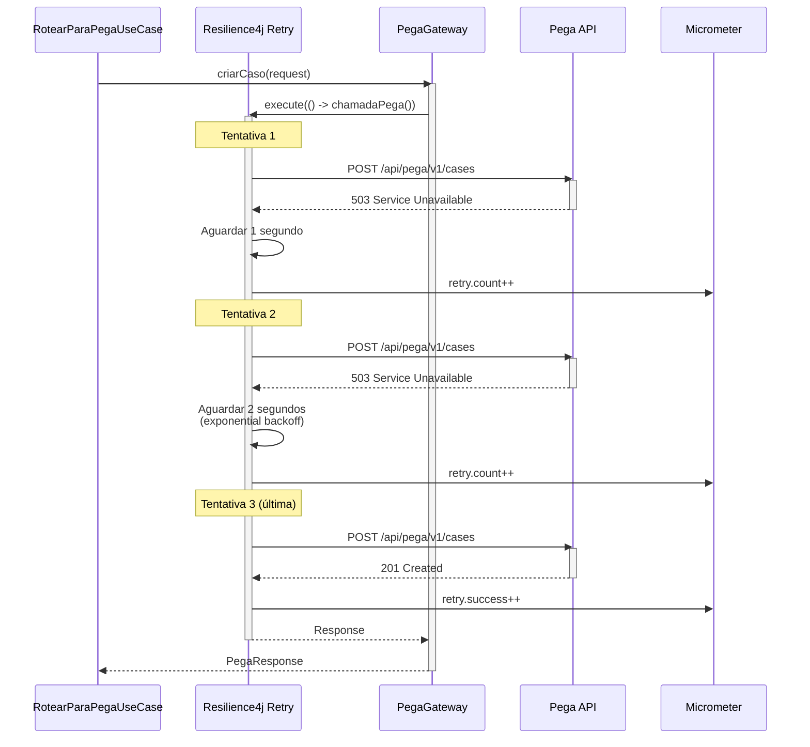

---

## Observações

### Renderização dos Diagramas

Estes diagramas podem ser visualizados em:
- **GitHub/GitLab** - Suporte nativo a Mermaid
- **Azure DevOps** - Plugin Mermaid
- **VS Code** - Extensão "Markdown Preview Mermaid Support"
- **Online** - https://mermaid.live

### Exportação

Para exportar como imagem:
1. Abrir em https://mermaid.live
2. Clicar em "Actions" → "Export"
3. Escolher formato (PNG, SVG, PDF)

### Convenções

- **Linhas sólidas** (→): Chamadas síncronas
- **Linhas tracejadas** (--→): Respostas
- **Boxes** (activate/deactivate): Tempo de vida de execução
- **alt/else**: Fluxos condicionais
- **loop**: Iterações
- **Note**: Comentários explicativos

---

**Documento elaborado por:** Equipe de Arquitetura  
**Última atualização:** Janeiro de 2026
