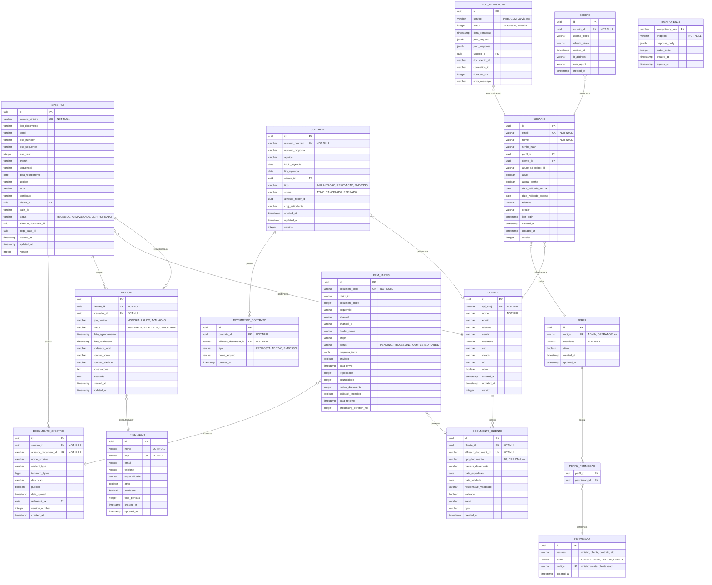

# Diagrama de Banco de Dados (ERD)
**App View v2.0 - Modelo de Dados**

**Versão:** 2.0.0  
**Data:** Janeiro de 2026  
**SGBD:** PostgreSQL 15+  

---

## 1. Visão Geral

O modelo de dados é organizado em 4 schemas principais:

- **`public`** - Tabelas de domínio (sinistros, clientes, contratos)
- **`audit`** - Tabelas de auditoria e rastreamento
- **`iam`** - Tabelas de autenticação e autorização
- **`integration`** - Tabelas de integração com sistemas externos

---

## 2. Diagrama ERD Completo (Mermaid)



---

## 3. Detalhamento das Tabelas

### 3.1 Schema `public` - Domínio

#### tb_sinistro

**Descrição:** Armazena informações de sinistros recebidos pelo sistema.

**DDL:**
```sql
CREATE TABLE public.tb_sinistro (
    id UUID PRIMARY KEY DEFAULT gen_random_uuid(),
    numero_sinistro VARCHAR(50) NOT NULL UNIQUE,
    tipo_documento VARCHAR(100) NOT NULL,
    canal VARCHAR(50),
    loss_number VARCHAR(50),
    loss_sequence VARCHAR(10),
    loss_year INTEGER,
    branch VARCHAR(50),
    sequencial VARCHAR(20),
    data_recebimento DATE NOT NULL,
    apolice VARCHAR(100),
    ramo VARCHAR(100),
    certificado VARCHAR(100),
    cliente_id UUID REFERENCES tb_cliente(id),
    claim_id VARCHAR(100),
    status VARCHAR(30) NOT NULL DEFAULT 'RECEBIDO',
    alfresco_document_id VARCHAR(255),
    pega_case_id VARCHAR(100),
    created_at TIMESTAMP NOT NULL DEFAULT CURRENT_TIMESTAMP,
    updated_at TIMESTAMP NOT NULL DEFAULT CURRENT_TIMESTAMP,
    version INTEGER NOT NULL DEFAULT 1,
    
    CONSTRAINT chk_status CHECK (status IN ('RECEBIDO', 'ARMAZENADO', 'ENVIADO_OCR', 'OCR_CONCLUIDO', 'ROTEADO_PEGA', 'ERRO'))
);

CREATE INDEX idx_sinistro_numero ON public.tb_sinistro(numero_sinistro);
CREATE INDEX idx_sinistro_claim_id ON public.tb_sinistro(claim_id);
CREATE INDEX idx_sinistro_status ON public.tb_sinistro(status);
CREATE INDEX idx_sinistro_data_recebimento ON public.tb_sinistro(data_recebimento);
CREATE INDEX idx_sinistro_cliente_id ON public.tb_sinistro(cliente_id);
```

**Índices:**
- `idx_sinistro_numero` - Busca por número (query mais frequente)
- `idx_sinistro_claim_id` - Integração com Pega
- `idx_sinistro_status` - Filtros de dashboard
- `idx_sinistro_data_recebimento` - Relatórios por período

**Considerações de Performance:**
- Particionamento por `data_recebimento` (mensal) quando volume > 10M registros
- Vacuum automático configurado (autovacuum_vacuum_scale_factor = 0.05)

#### tb_cliente

**DDL:**
```sql
CREATE TABLE public.tb_cliente (
    id UUID PRIMARY KEY DEFAULT gen_random_uuid(),
    cpf_cnpj VARCHAR(20) NOT NULL UNIQUE,
    nome VARCHAR(255) NOT NULL,
    email VARCHAR(255),
    telefone VARCHAR(20),
    celular VARCHAR(20),
    endereco VARCHAR(500),
    cep VARCHAR(10),
    cidade VARCHAR(100),
    uf CHAR(2),
    ativo BOOLEAN NOT NULL DEFAULT TRUE,
    created_at TIMESTAMP NOT NULL DEFAULT CURRENT_TIMESTAMP,
    updated_at TIMESTAMP NOT NULL DEFAULT CURRENT_TIMESTAMP,
    version INTEGER NOT NULL DEFAULT 1,
    
    CONSTRAINT chk_cpf_cnpj_format CHECK (
        cpf_cnpj ~ '^[0-9]{11}$' OR cpf_cnpj ~ '^[0-9]{14}$'
    )
);

CREATE INDEX idx_cliente_cpf_cnpj ON public.tb_cliente(cpf_cnpj);
CREATE INDEX idx_cliente_nome ON public.tb_cliente USING gin(to_tsvector('portuguese', nome));
```

**Índices:**
- `idx_cliente_cpf_cnpj` - Primary lookup
- `idx_cliente_nome` - Full-text search (GIN index)

#### tb_contrato

**DDL:**
```sql
CREATE TABLE public.tb_contrato (
    id UUID PRIMARY KEY DEFAULT gen_random_uuid(),
    numero_contrato VARCHAR(50) NOT NULL UNIQUE,
    numero_proposta VARCHAR(50),
    apolice VARCHAR(100),
    inicio_vigencia DATE NOT NULL,
    fim_vigencia DATE NOT NULL,
    cliente_id UUID NOT NULL REFERENCES tb_cliente(id),
    tipo VARCHAR(30) NOT NULL,
    status VARCHAR(30) NOT NULL DEFAULT 'ATIVO',
    alfresco_folder_id VARCHAR(255),
    cnpj_estipulante VARCHAR(20),
    created_at TIMESTAMP NOT NULL DEFAULT CURRENT_TIMESTAMP,
    updated_at TIMESTAMP NOT NULL DEFAULT CURRENT_TIMESTAMP,
    version INTEGER NOT NULL DEFAULT 1,
    
    CONSTRAINT chk_contrato_tipo CHECK (tipo IN ('IMPLANTACAO', 'RENOVACAO', 'ENDOSSO', 'CANCELAMENTO')),
    CONSTRAINT chk_contrato_status CHECK (status IN ('ATIVO', 'CANCELADO', 'EXPIRADO', 'PENDENTE')),
    CONSTRAINT chk_vigencia CHECK (fim_vigencia > inicio_vigencia)
);

CREATE INDEX idx_contrato_numero ON public.tb_contrato(numero_contrato);
CREATE INDEX idx_contrato_cliente_id ON public.tb_contrato(cliente_id);
CREATE INDEX idx_contrato_status ON public.tb_contrato(status);
CREATE INDEX idx_contrato_vigencia ON public.tb_contrato(inicio_vigencia, fim_vigencia);
```

#### tb_pericia

**DDL:**
```sql
CREATE TABLE public.tb_pericia (
    id UUID PRIMARY KEY DEFAULT gen_random_uuid(),
    sinistro_id UUID NOT NULL REFERENCES tb_sinistro(id) ON DELETE CASCADE,
    prestador_id UUID NOT NULL REFERENCES tb_prestador(id),
    tipo_pericia VARCHAR(50) NOT NULL,
    status VARCHAR(30) NOT NULL DEFAULT 'AGENDADA',
    data_agendamento TIMESTAMP NOT NULL,
    data_realizacao TIMESTAMP,
    endereco_local VARCHAR(500),
    contato_nome VARCHAR(255),
    contato_telefone VARCHAR(20),
    observacoes TEXT,
    resultado TEXT,
    created_at TIMESTAMP NOT NULL DEFAULT CURRENT_TIMESTAMP,
    updated_at TIMESTAMP NOT NULL DEFAULT CURRENT_TIMESTAMP,
    
    CONSTRAINT chk_pericia_status CHECK (status IN ('AGENDADA', 'REALIZADA', 'CANCELADA', 'NAO_COMPARECEU'))
);

CREATE INDEX idx_pericia_sinistro_id ON public.tb_pericia(sinistro_id);
CREATE INDEX idx_pericia_prestador_id ON public.tb_pericia(prestador_id);
CREATE INDEX idx_pericia_data_agendamento ON public.tb_pericia(data_agendamento);
CREATE INDEX idx_pericia_status ON public.tb_pericia(status);
```

---

### 3.2 Schema `audit` - Auditoria e Rastreamento

#### audit.tb_log_transacao

**Descrição:** Log de auditoria de todas as integrações com sistemas externos.

**DDL:**
```sql
CREATE TABLE audit.tb_log_transacao (
    id UUID PRIMARY KEY DEFAULT gen_random_uuid(),
    servico VARCHAR(100) NOT NULL,
    status INTEGER NOT NULL,
    data_transacao TIMESTAMP NOT NULL DEFAULT CURRENT_TIMESTAMP,
    json_request JSONB,
    json_response JSONB,
    usuario_id UUID REFERENCES iam.tb_usuario(id),
    documento_id VARCHAR(255),
    correlation_id VARCHAR(100) NOT NULL,
    duracao_ms INTEGER,
    error_message TEXT,
    http_status_code INTEGER,
    retry_count INTEGER DEFAULT 0,
    
    CONSTRAINT chk_status CHECK (status IN (1, 2))
);

CREATE INDEX idx_log_servico ON audit.tb_log_transacao(servico);
CREATE INDEX idx_log_status ON audit.tb_log_transacao(status);
CREATE INDEX idx_log_data_transacao ON audit.tb_log_transacao(data_transacao DESC);
CREATE INDEX idx_log_correlation_id ON audit.tb_log_transacao(correlation_id);
CREATE INDEX idx_log_usuario_id ON audit.tb_log_transacao(usuario_id);
CREATE INDEX idx_log_request ON audit.tb_log_transacao USING gin(json_request);
```

**Particionamento:**
```sql
-- Particionamento por mês para performance
CREATE TABLE audit.tb_log_transacao_2026_01 PARTITION OF audit.tb_log_transacao
    FOR VALUES FROM ('2026-01-01') TO ('2026-02-01');

CREATE TABLE audit.tb_log_transacao_2026_02 PARTITION OF audit.tb_log_transacao
    FOR VALUES FROM ('2026-02-01') TO ('2026-03-01');
```

**Valores de `servico`:**
- `Pega Sinistro`
- `Pega Cliente`
- `CCM`
- `Jarvis OCR`
- `Prestador Cliente`
- `Prestador Sinistro`
- `Portal PJ`
- `BOD Implantacao`
- `BOD Renovacao`
- `BOD Endosso`

#### audit.tb_ecm_jarvis

**Descrição:** Rastreamento específico de processamento OCR do Jarvis.

**DDL:**
```sql
CREATE TABLE audit.tb_ecm_jarvis (
    id UUID PRIMARY KEY DEFAULT gen_random_uuid(),
    document_code VARCHAR(255) NOT NULL UNIQUE,
    claim_id VARCHAR(100),
    document_index INTEGER,
    sequential VARCHAR(50),
    channel VARCHAR(50),
    channel_id VARCHAR(100),
    holder_name VARCHAR(255),
    origin VARCHAR(100),
    status VARCHAR(30) NOT NULL DEFAULT 'PENDING',
    resposta_jarvis JSONB,
    enviado BOOLEAN NOT NULL DEFAULT FALSE,
    data_envio TIMESTAMP,
    legibilidade INTEGER,
    acuracidade INTEGER,
    match_documento INTEGER,
    callback_recebido BOOLEAN NOT NULL DEFAULT FALSE,
    data_retorno TIMESTAMP,
    processing_duration_ms INTEGER,
    retry_count INTEGER DEFAULT 0,
    
    CONSTRAINT chk_jarvis_status CHECK (status IN ('PENDING', 'PROCESSING', 'COMPLETED', 'FAILED', 'POOR_QUALITY')),
    CONSTRAINT chk_scores CHECK (
        (legibilidade IS NULL OR (legibilidade >= 0 AND legibilidade <= 100)) AND
        (acuracidade IS NULL OR (acuracidade >= 0 AND acuracidade <= 100)) AND
        (match_documento IS NULL OR (match_documento >= 0 AND match_documento <= 100))
    )
);

CREATE INDEX idx_jarvis_document_code ON audit.tb_ecm_jarvis(document_code);
CREATE INDEX idx_jarvis_claim_id ON audit.tb_ecm_jarvis(claim_id);
CREATE INDEX idx_jarvis_status ON audit.tb_ecm_jarvis(status);
CREATE INDEX idx_jarvis_data_envio ON audit.tb_ecm_jarvis(data_envio);
CREATE INDEX idx_jarvis_callback_pendente ON audit.tb_ecm_jarvis(callback_recebido) WHERE callback_recebido = FALSE;
```

#### audit.tb_idempotency

**Descrição:** Controle de idempotência de requisições.

**DDL:**
```sql
CREATE TABLE audit.tb_idempotency (
    idempotency_key VARCHAR(100) NOT NULL,
    endpoint VARCHAR(255) NOT NULL,
    response_body JSONB NOT NULL,
    status_code INTEGER NOT NULL,
    created_at TIMESTAMP NOT NULL DEFAULT CURRENT_TIMESTAMP,
    expires_at TIMESTAMP NOT NULL,
    
    PRIMARY KEY (idempotency_key, endpoint)
);

CREATE INDEX idx_idempotency_expires_at ON audit.tb_idempotency(expires_at);

-- TTL automático (cleanup de registros expirados)
CREATE OR REPLACE FUNCTION cleanup_expired_idempotency()
RETURNS void AS $$
BEGIN
    DELETE FROM audit.tb_idempotency WHERE expires_at < NOW();
END;
$$ LANGUAGE plpgsql;

-- Scheduled job (via pg_cron ou application scheduler)
SELECT cron.schedule('cleanup-idempotency', '0 * * * *', 'SELECT cleanup_expired_idempotency()');
```

---

### 3.3 Schema `iam` - Autenticação e Autorização

#### iam.tb_usuario

**DDL:**
```sql
CREATE TABLE iam.tb_usuario (
    id UUID PRIMARY KEY DEFAULT gen_random_uuid(),
    email VARCHAR(255) NOT NULL UNIQUE,
    nome VARCHAR(255) NOT NULL,
    senha_hash VARCHAR(255),
    perfil_id UUID REFERENCES iam.tb_perfil(id),
    cliente_id UUID REFERENCES public.tb_cliente(id),
    azure_ad_object_id VARCHAR(100),
    ativo BOOLEAN NOT NULL DEFAULT TRUE,
    alterar_senha BOOLEAN NOT NULL DEFAULT FALSE,
    data_validade_senha DATE,
    data_validade_acesso DATE,
    telefone VARCHAR(20),
    celular VARCHAR(20),
    last_login TIMESTAMP,
    created_at TIMESTAMP NOT NULL DEFAULT CURRENT_TIMESTAMP,
    updated_at TIMESTAMP NOT NULL DEFAULT CURRENT_TIMESTAMP,
    version INTEGER NOT NULL DEFAULT 1
);

CREATE INDEX idx_usuario_email ON iam.tb_usuario(email);
CREATE INDEX idx_usuario_perfil_id ON iam.tb_usuario(perfil_id);
CREATE INDEX idx_usuario_cliente_id ON iam.tb_usuario(cliente_id);
CREATE INDEX idx_usuario_azure_ad ON iam.tb_usuario(azure_ad_object_id);
```

#### iam.tb_perfil

**DDL:**
```sql
CREATE TABLE iam.tb_perfil (
    id UUID PRIMARY KEY DEFAULT gen_random_uuid(),
    codigo VARCHAR(50) NOT NULL UNIQUE,
    descricao VARCHAR(255) NOT NULL,
    ativo BOOLEAN NOT NULL DEFAULT TRUE,
    created_at TIMESTAMP NOT NULL DEFAULT CURRENT_TIMESTAMP,
    updated_at TIMESTAMP NOT NULL DEFAULT CURRENT_TIMESTAMP
);

-- Perfis padrão
INSERT INTO iam.tb_perfil (codigo, descricao) VALUES
    ('ADMIN', 'Administrador do Sistema'),
    ('OPERADOR', 'Operador de Sinistros e Clientes'),
    ('PRESTADOR', 'Prestador de Serviços'),
    ('JURIDICO', 'Acesso ao Portal Jurídico'),
    ('CONSULTA', 'Apenas Consulta');
```

#### iam.tb_permissao

**DDL:**
```sql
CREATE TABLE iam.tb_permissao (
    id UUID PRIMARY KEY DEFAULT gen_random_uuid(),
    recurso VARCHAR(50) NOT NULL,
    acao VARCHAR(20) NOT NULL,
    codigo VARCHAR(100) NOT NULL UNIQUE,
    created_at TIMESTAMP NOT NULL DEFAULT CURRENT_TIMESTAMP,
    
    CONSTRAINT chk_acao CHECK (acao IN ('CREATE', 'READ', 'UPDATE', 'DELETE', 'EXECUTE'))
);

CREATE INDEX idx_permissao_codigo ON iam.tb_permissao(codigo);

-- Permissões padrão
INSERT INTO iam.tb_permissao (recurso, acao, codigo) VALUES
    ('sinistro', 'CREATE', 'sinistro:create'),
    ('sinistro', 'READ', 'sinistro:read'),
    ('sinistro', 'UPDATE', 'sinistro:update'),
    ('cliente', 'CREATE', 'cliente:create'),
    ('cliente', 'READ', 'cliente:read'),
    ('contrato', 'CREATE', 'contrato:create'),
    ('contrato', 'READ', 'contrato:read'),
    ('pericia', 'CREATE', 'pericia:create'),
    ('pericia', 'READ', 'pericia:read'),
    ('relatorio', 'READ', 'relatorio:read');
```

#### iam.tb_perfil_permissao

**DDL:**
```sql
CREATE TABLE iam.tb_perfil_permissao (
    perfil_id UUID NOT NULL REFERENCES iam.tb_perfil(id) ON DELETE CASCADE,
    permissao_id UUID NOT NULL REFERENCES iam.tb_permissao(id) ON DELETE CASCADE,
    PRIMARY KEY (perfil_id, permissao_id)
);

-- Permissões do perfil ADMIN
INSERT INTO iam.tb_perfil_permissao (perfil_id, permissao_id)
SELECT 
    (SELECT id FROM iam.tb_perfil WHERE codigo = 'ADMIN'),
    id
FROM iam.tb_permissao;

-- Permissões do perfil OPERADOR
INSERT INTO iam.tb_perfil_permissao (perfil_id, permissao_id)
SELECT 
    (SELECT id FROM iam.tb_perfil WHERE codigo = 'OPERADOR'),
    id
FROM iam.tb_permissao
WHERE codigo IN ('sinistro:create', 'sinistro:read', 'sinistro:update', 'cliente:create', 'cliente:read');
```

#### iam.tb_sessao

**DDL:**
```sql
CREATE TABLE iam.tb_sessao (
    id UUID PRIMARY KEY DEFAULT gen_random_uuid(),
    usuario_id UUID NOT NULL REFERENCES iam.tb_usuario(id) ON DELETE CASCADE,
    access_token TEXT NOT NULL,
    refresh_token TEXT,
    expires_at TIMESTAMP NOT NULL,
    ip_address VARCHAR(45),
    user_agent TEXT,
    created_at TIMESTAMP NOT NULL DEFAULT CURRENT_TIMESTAMP
);

CREATE INDEX idx_sessao_usuario_id ON iam.tb_sessao(usuario_id);
CREATE INDEX idx_sessao_expires_at ON iam.tb_sessao(expires_at);
CREATE INDEX idx_sessao_access_token ON iam.tb_sessao USING hash(access_token);

-- Cleanup de sessões expiradas
CREATE OR REPLACE FUNCTION cleanup_expired_sessions()
RETURNS void AS $$
BEGIN
    DELETE FROM iam.tb_sessao WHERE expires_at < NOW();
END;
$$ LANGUAGE plpgsql;
```

---

### 3.4 Schema `integration` - Integrações

#### integration.tb_webhook_log

**Descrição:** Log de webhooks recebidos de sistemas externos.

**DDL:**
```sql
CREATE TABLE integration.tb_webhook_log (
    id UUID PRIMARY KEY DEFAULT gen_random_uuid(),
    source_system VARCHAR(50) NOT NULL,
    endpoint VARCHAR(255) NOT NULL,
    payload JSONB NOT NULL,
    headers JSONB,
    signature VARCHAR(500),
    signature_valid BOOLEAN,
    processed BOOLEAN NOT NULL DEFAULT FALSE,
    processing_error TEXT,
    received_at TIMESTAMP NOT NULL DEFAULT CURRENT_TIMESTAMP,
    processed_at TIMESTAMP
);

CREATE INDEX idx_webhook_source ON integration.tb_webhook_log(source_system);
CREATE INDEX idx_webhook_processed ON integration.tb_webhook_log(processed) WHERE processed = FALSE;
CREATE INDEX idx_webhook_received_at ON integration.tb_webhook_log(received_at);
```

---

## 4. Views Materializadas para Performance

### 4.1 Dashboard de Métricas

```sql
CREATE MATERIALIZED VIEW public.mv_dashboard_metricas AS
SELECT
    DATE(data_transacao) as data,
    servico,
    COUNT(*) as total_transacoes,
    COUNT(*) FILTER (WHERE status = 1) as total_sucesso,
    COUNT(*) FILTER (WHERE status = 2) as total_falha,
    ROUND(AVG(duracao_ms)::numeric, 2) as latencia_media_ms,
    PERCENTILE_CONT(0.95) WITHIN GROUP (ORDER BY duracao_ms) as latencia_p95_ms,
    ROUND((COUNT(*) FILTER (WHERE status = 1)::numeric / COUNT(*)::numeric * 100), 2) as taxa_sucesso_pct
FROM audit.tb_log_transacao
WHERE data_transacao >= CURRENT_DATE - INTERVAL '30 days'
GROUP BY DATE(data_transacao), servico;

CREATE UNIQUE INDEX idx_mv_dashboard_data_servico ON public.mv_dashboard_metricas(data, servico);

-- Refresh automático a cada 5 minutos
CREATE OR REPLACE FUNCTION refresh_dashboard_metricas()
RETURNS void AS $$
BEGIN
    REFRESH MATERIALIZED VIEW CONCURRENTLY public.mv_dashboard_metricas;
END;
$$ LANGUAGE plpgsql;
```

### 4.2 Scores Médios de OCR

```sql
CREATE MATERIALIZED VIEW public.mv_ocr_scores AS
SELECT
    DATE(data_retorno) as data,
    COUNT(*) as total_documentos,
    ROUND(AVG(legibilidade)::numeric, 2) as legibilidade_media,
    ROUND(AVG(acuracidade)::numeric, 2) as acuracidade_media,
    ROUND(AVG(match_documento)::numeric, 2) as match_media,
    COUNT(*) FILTER (WHERE legibilidade < 60) as baixa_qualidade,
    ROUND((COUNT(*) FILTER (WHERE legibilidade >= 60)::numeric / COUNT(*)::numeric * 100), 2) as taxa_aprovacao_pct
FROM audit.tb_ecm_jarvis
WHERE status = 'COMPLETED'
  AND data_retorno >= CURRENT_DATE - INTERVAL '30 days'
GROUP BY DATE(data_retorno);

CREATE UNIQUE INDEX idx_mv_ocr_data ON public.mv_ocr_scores(data);
```

---

## 5. Triggers e Funções

### 5.1 Trigger de Atualização de `updated_at`

```sql
CREATE OR REPLACE FUNCTION update_updated_at_column()
RETURNS TRIGGER AS $$
BEGIN
    NEW.updated_at = CURRENT_TIMESTAMP;
    RETURN NEW;
END;
$$ LANGUAGE plpgsql;

-- Aplicar em todas as tabelas com updated_at
CREATE TRIGGER trg_sinistro_updated_at
    BEFORE UPDATE ON public.tb_sinistro
    FOR EACH ROW
    EXECUTE FUNCTION update_updated_at_column();

CREATE TRIGGER trg_cliente_updated_at
    BEFORE UPDATE ON public.tb_cliente
    FOR EACH ROW
    EXECUTE FUNCTION update_updated_at_column();

CREATE TRIGGER trg_contrato_updated_at
    BEFORE UPDATE ON public.tb_contrato
    FOR EACH ROW
    EXECUTE FUNCTION update_updated_at_column();
```

### 5.2 Trigger de Versionamento Otimista

```sql
CREATE OR REPLACE FUNCTION increment_version()
RETURNS TRIGGER AS $$
BEGIN
    IF NEW.version <= OLD.version THEN
        RAISE EXCEPTION 'Concurrent modification detected. Expected version %, found %', 
            NEW.version, OLD.version;
    END IF;
    NEW.version = OLD.version + 1;
    RETURN NEW;
END;
$$ LANGUAGE plpgsql;

CREATE TRIGGER trg_sinistro_version
    BEFORE UPDATE ON public.tb_sinistro
    FOR EACH ROW
    EXECUTE FUNCTION increment_version();
```

---

## 6. Consultas de Performance

### 6.1 Buscar Sinistros com Documentos

```sql
-- Otimizado com JOIN e índices
SELECT 
    s.id,
    s.numero_sinistro,
    s.status,
    s.data_recebimento,
    c.nome as nome_cliente,
    COUNT(ds.id) as total_documentos,
    MAX(ej.legibilidade) as melhor_legibilidade
FROM public.tb_sinistro s
LEFT JOIN public.tb_cliente c ON s.cliente_id = c.id
LEFT JOIN public.tb_documento_sinistro ds ON s.id = ds.sinistro_id
LEFT JOIN audit.tb_ecm_jarvis ej ON ds.alfresco_document_id = ej.document_code
WHERE s.data_recebimento >= CURRENT_DATE - INTERVAL '7 days'
  AND s.status != 'ERRO'
GROUP BY s.id, s.numero_sinistro, s.status, s.data_recebimento, c.nome
ORDER BY s.data_recebimento DESC
LIMIT 100;
```

**Execution Plan:** Index Scan on `idx_sinistro_data_recebimento`

### 6.2 Dashboard de Taxa de Sucesso

```sql
-- Utiliza materialized view para performance
SELECT 
    servico,
    SUM(total_sucesso) as total_sucesso,
    SUM(total_falha) as total_falha,
    ROUND(AVG(taxa_sucesso_pct), 2) as taxa_sucesso_media
FROM public.mv_dashboard_metricas
WHERE data >= CURRENT_DATE - INTERVAL '7 days'
GROUP BY servico
ORDER BY servico;
```

---

## 7. Políticas de Backup e Retenção

### 7.1 Backup

**Frequência:**
- Backup completo: Diário às 02:00 UTC
- Backup incremental: A cada 6 horas
- Retenção: 30 dias (diários), 12 meses (mensais)

**Azure Database for PostgreSQL:**
- Automated backups habilitados
- Point-in-time restore: 7 dias
- Geo-redundant backup: Habilitado

### 7.2 Retenção de Dados

| Tabela | Retenção | Estratégia |
|--------|----------|------------|
| `tb_sinistro` | 7 anos | Arquivamento após 2 anos |
| `tb_cliente` | Indeterminado | Soft delete |
| `tb_contrato` | 10 anos | Arquivamento após 5 anos |
| `tb_log_transacao` | 1 ano | Particionamento + drop de partições antigas |
| `tb_ecm_jarvis` | 6 meses | Purge automático |
| `tb_idempotency` | 24 horas | TTL automático |
| `tb_sessao` | 7 dias | Cleanup diário |

---

## 8. Considerações de Escalabilidade

### 8.1 Particionamento

**tb_log_transacao:**
- Particionamento por RANGE (data_transacao)
- Partições mensais
- Drop automático de partições > 1 ano

**tb_ecm_jarvis:**
- Particionamento por RANGE (data_envio)
- Partições mensais
- Drop automático de partições > 6 meses

### 8.2 Índices Parciais

```sql
-- Apenas documentos pendentes de callback
CREATE INDEX idx_jarvis_pendentes 
ON audit.tb_ecm_jarvis(data_envio) 
WHERE callback_recebido = FALSE;

-- Apenas sinistros ativos
CREATE INDEX idx_sinistro_ativos 
ON public.tb_sinistro(created_at) 
WHERE status NOT IN ('ERRO', 'CANCELADO');
```

### 8.3 JSONB Indexing

```sql
-- Busca em campos específicos do JSON
CREATE INDEX idx_log_request_servico 
ON audit.tb_log_transacao 
USING gin((json_request -> 'numeroSinistro'));

-- GIN index para full-text em JSON
CREATE INDEX idx_log_request_fulltext 
ON audit.tb_log_transacao 
USING gin(json_request jsonb_path_ops);
```

---

## 9. Migration Strategy (Flyway)

### 9.1 Estrutura de Migrations

```
src/main/resources/db/migration/
├── V1__create_schema_public.sql
├── V2__create_schema_audit.sql
├── V3__create_schema_iam.sql
├── V4__create_schema_integration.sql
├── V5__create_table_sinistro.sql
├── V6__create_table_cliente.sql
├── V7__create_table_contrato.sql
├── V8__create_table_log_transacao.sql
├── V9__create_table_ecm_jarvis.sql
├── V10__create_table_idempotency.sql
├── V11__create_table_usuario.sql
├── V12__create_table_perfil.sql
├── V13__create_indexes.sql
├── V14__create_materialized_views.sql
├── V15__create_triggers.sql
├── V16__insert_master_data.sql
└── V17__create_partitions.sql
```

### 9.2 Exemplo de Migration

**V5__create_table_sinistro.sql:**
```sql
CREATE TABLE IF NOT EXISTS public.tb_sinistro (
    id UUID PRIMARY KEY DEFAULT gen_random_uuid(),
    numero_sinistro VARCHAR(50) NOT NULL UNIQUE,
    -- ... demais campos
    created_at TIMESTAMP NOT NULL DEFAULT CURRENT_TIMESTAMP,
    updated_at TIMESTAMP NOT NULL DEFAULT CURRENT_TIMESTAMP,
    version INTEGER NOT NULL DEFAULT 1
);

COMMENT ON TABLE public.tb_sinistro IS 'Armazena documentos de sinistros recebidos pelo sistema';
COMMENT ON COLUMN public.tb_sinistro.numero_sinistro IS 'Número único do sinistro (formato: SIN + 6 dígitos)';
COMMENT ON COLUMN public.tb_sinistro.status IS 'Status do processamento: RECEBIDO → ARMAZENADO → OCR_CONCLUIDO → ROTEADO_PEGA';
```

---

## 10. Queries de Manutenção

### 10.1 Análise de Tamanho de Tabelas

```sql
SELECT
    schemaname,
    tablename,
    pg_size_pretty(pg_total_relation_size(schemaname||'.'||tablename)) AS size,
    pg_size_pretty(pg_relation_size(schemaname||'.'||tablename)) AS table_size,
    pg_size_pretty(pg_total_relation_size(schemaname||'.'||tablename) - pg_relation_size(schemaname||'.'||tablename)) AS indexes_size
FROM pg_tables
WHERE schemaname IN ('public', 'audit', 'iam')
ORDER BY pg_total_relation_size(schemaname||'.'||tablename) DESC;
```

### 10.2 Índices Não Utilizados

```sql
SELECT
    schemaname,
    tablename,
    indexname,
    idx_scan,
    pg_size_pretty(pg_relation_size(indexrelid)) as index_size
FROM pg_stat_user_indexes
WHERE idx_scan = 0
  AND schemaname IN ('public', 'audit', 'iam')
ORDER BY pg_relation_size(indexrelid) DESC;
```

### 10.3 Vacuum e Analyze

```sql
-- Vacuum manual (em caso de muitas atualizações)
VACUUM ANALYZE public.tb_sinistro;
VACUUM ANALYZE audit.tb_log_transacao;

-- Configuração de autovacuum agressivo para tabelas de alta escrita
ALTER TABLE audit.tb_log_transacao SET (
    autovacuum_vacuum_scale_factor = 0.05,
    autovacuum_analyze_scale_factor = 0.02
);
```

---

**Documento elaborado por:** Equipe de Arquitetura  
**Última atualização:** Janeiro de 2026
