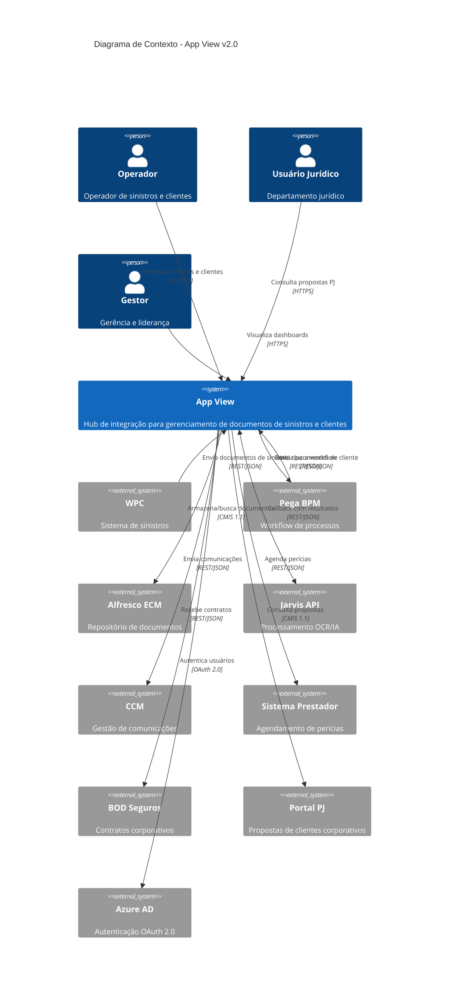
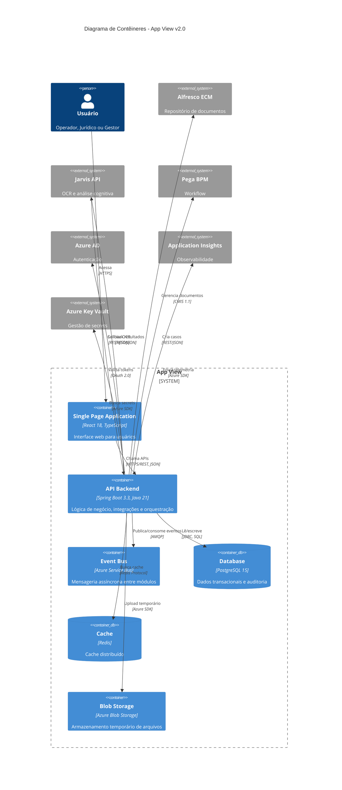
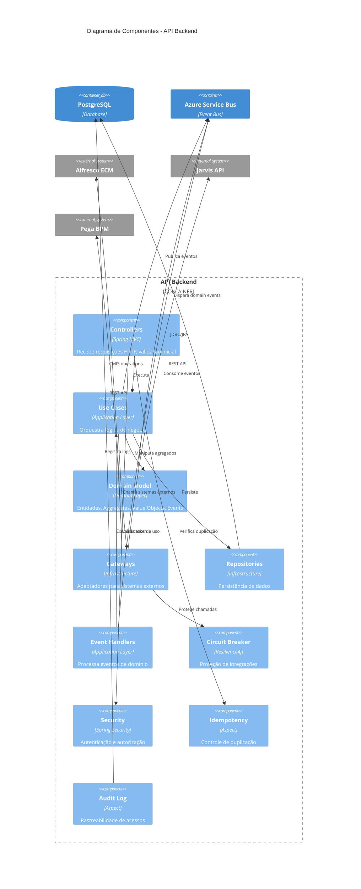
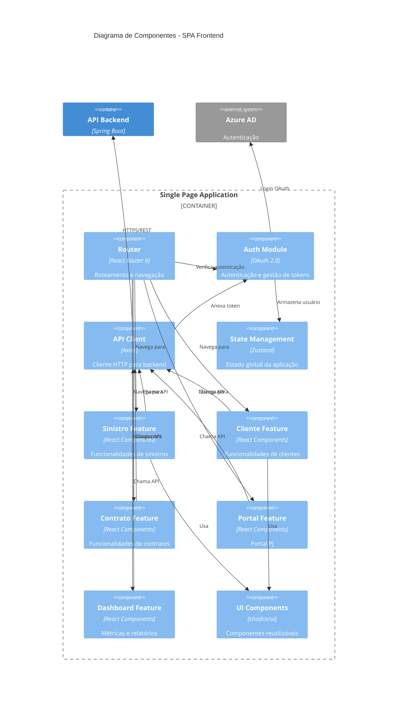

# Diagramas C4 - Model de Arquitetura
**App View v2.0 - Visão Arquitetural**

**Versão:** 2.0.0  
**Data:** Janeiro de 2026  

---

## Visão Geral

Este documento apresenta os diagramas **C4 (Context, Container, Component)** que descrevem a arquitetura do sistema App View em múltiplos níveis de abstração.

---

## Nível 1: Diagrama de Contexto

### Descrição
Visão de mais alto nível mostrando o App View e seus relacionamentos com usuários e sistemas externos.



### Atores

| Ator | Descrição | Perfis |
|------|-----------|--------|
| **Operador** | Usuários do BackOffice que processam sinistros e clientes | OPERADOR |
| **Usuário Jurídico** | Equipe jurídica que consulta propostas corporativas | JURIDICO |
| **Gestor** | Liderança que visualiza métricas e relatórios | GESTOR |

### Sistemas Externos

| Sistema | Propósito | Protocolo | Criticidade |
|---------|-----------|-----------|-------------|
| **WPC** | Origem de documentos de sinistros | REST/JSON | Alta |
| **Pega BPM** | Workflow e orquestração de processos | REST/JSON | Alta |
| **Alfresco ECM** | Armazenamento centralizado de documentos | CMIS 1.1 | Crítica |
| **Jarvis API** | Análise OCR e extração de dados | REST/JSON | Alta |
| **CCM** | Envio de comunicações (email/SMS) | REST/JSON | Média |
| **Sistema Prestador** | Agendamento de perícias técnicas | REST/JSON | Média |
| **BOD Seguros** | Gestão de contratos corporativos | REST/JSON | Média |
| **Portal PJ** | Propostas de clientes jurídicos | CMIS 1.1 | Baixa |
| **Azure AD** | Autenticação e autorização | OAuth 2.0 | Crítica |

---

## Nível 2: Diagrama de Contêineres

### Descrição
Mostra os contêineres (aplicações, data stores) que compõem o App View e como eles se comunicam.



### Contêineres

#### 1. Single Page Application (SPA)
- **Tecnologia:** React 18, TypeScript, Vite
- **Responsabilidade:** Interface do usuário, validação client-side, gerenciamento de estado
- **Deployment:** Azure Static Web Apps
- **Porta:** 443 (HTTPS)

#### 2. API Backend
- **Tecnologia:** Spring Boot 3.3, Java 21
- **Responsabilidade:** Lógica de negócio, orquestração de integrações, validações
- **Deployment:** Azure App Service
- **Porta:** 8080 (interno), 443 (externo via App Service)
- **Arquitetura:** Clean Architecture + DDD + Event-Driven

#### 3. Event Bus (Azure Service Bus)
- **Tecnologia:** Azure Service Bus (PaaS)
- **Responsabilidade:** Comunicação assíncrona entre módulos, retry de falhas
- **Filas:** 
  - `jarvis-ocr-queue`
  - `pega-routing-queue`
  - `notification-queue`
  - `alfresco-retry-queue`

#### 4. Database (PostgreSQL 15)
- **Tecnologia:** Azure Database for PostgreSQL Flexible Server
- **Responsabilidade:** Persistência de dados, auditoria, idempotência
- **Schemas:** public, audit, iam, integration

#### 5. Cache (Redis)
- **Tecnologia:** Azure Cache for Redis
- **Responsabilidade:** Cache de queries, sessões, rate limiting
- **TTL:** 5 minutos (consultas), 8 horas (sessões)

#### 6. Blob Storage
- **Tecnologia:** Azure Blob Storage
- **Responsabilidade:** Armazenamento temporário de uploads antes de enviar ao Alfresco
- **Retenção:** 24 horas

---

## Nível 3: Diagrama de Componentes - API Backend

### Descrição
Decomposição interna da API Backend mostrando os componentes principais e suas interações.



### Componentes Detalhados

#### Controllers (Infrastructure Layer)
Responsabilidade: Receber requisições HTTP, validação de entrada, serialização/deserialização.

**Principais Controllers:**
- `SinistroController` - POST /api/sinistros, GET /api/sinistros/{id}
- `ClienteController` - POST /api/clientes, GET /api/clientes/{id}
- `ContratoController` - POST /api/bod/implantacao, GET /api/contratos
- `PericiaController` - POST /api/pericias, GET /api/pericias
- `PortalController` - GET /api/portal/propostas
- `RelatorioController` - GET /api/relatorios/dashboard
- `JarvisCallbackController` - POST /api/jarvis/callback

**Exemplo:**
```java
@RestController
@RequestMapping("/api/sinistros")
@RequiredArgsConstructor
public class SinistroController {
    
    private final ReceberSinistroUseCase receberSinistroUseCase;
    
    @PostMapping
    @RequiresPermission("sinistro:create")
    public ResponseEntity<SinistroResponse> receber(
            @RequestBody @Valid SinistroRequest request,
            @RequestHeader("Idempotency-Key") String idempotencyKey) {
        
        var command = SinistroMapper.toCommand(request, idempotencyKey);
        var result = receberSinistroUseCase.executar(command);
        
        return ResponseEntity.accepted()
            .body(SinistroMapper.toResponse(result));
    }
}
```

---

#### Use Cases (Application Layer)
Responsabilidade: Orquestrar lógica de negócio, coordenar operações entre domínio e infraestrutura.

**Módulo Sinistro:**
- `ReceberSinistroUseCase`
- `ArmazenarSinistroNoECMUseCase`
- `EnviarSinistroParaOCRUseCase`
- `ProcessarCallbackOCRUseCase`
- `RotearSinistroParaPegaUseCase`
- `ConsultarSinistroUseCase`

**Módulo Cliente:**
- `ReceberDocumentoClienteUseCase`
- `ConsultarClienteUseCase`

**Módulo Contrato:**
- `ImplantarContratoUseCase`
- `ConsultarContratosUseCase`

**Módulo Perícia:**
- `AgendarPericiaUseCase`
- `AtualizarStatusPericiaUseCase`

**Módulo Portal:**
- `ConsultarPropostasUseCase`

**Módulo Relatórios:**
- `GerarDashboardUseCase`

**Exemplo:**
```java
@UseCase
@RequiredArgsConstructor
public class ReceberSinistroUseCase {
    
    private final SinistroRepository repository;
    private final IdempotencyService idempotencyService;
    private final DomainEventPublisher eventPublisher;
    
    @Transactional
    public SinistroId executar(ReceberSinistroCommand command) {
        // Verificar idempotência
        var cached = idempotencyService.buscar(command.idempotencyKey());
        if (cached.isPresent()) {
            return cached.get();
        }
        
        // Criar sinistro (domain logic)
        var sinistro = Sinistro.criar(
            command.toData(),
            repository
        );
        
        // Persistir
        repository.save(sinistro);
        
        // Publicar evento de domínio
        eventPublisher.publish(
            new SinistroRecebidoEvent(sinistro.getId())
        );
        
        // Cachear resultado
        idempotencyService.cachear(command.idempotencyKey(), sinistro.getId());
        
        return sinistro.getId();
    }
}
```

---

#### Domain Model (Domain Layer)
Responsabilidade: Regras de negócio, invariantes, lógica de domínio pura.

**Agregados:**
- `Sinistro` (Root)
- `Cliente` (Root)
- `Contrato` (Root)
- `Pericia` (Root)

**Value Objects:**
- `SinistroId`, `ClienteId`, `ContratoId`, `PericiaId`
- `CPF`, `CNPJ`
- `Email`, `Telefone`
- `LossInfo`

**Domain Events:**
- `SinistroRecebidoEvent`
- `SinistroArmazenadoEvent`
- `OCRConcluidoEvent`
- `DocumentoClienteRecebidoEvent`
- `PericiaAgendadaEvent`

**Exemplo:**
```java
@Entity
@Table(name = "tb_sinistro", schema = "public")
public class Sinistro extends AggregateRoot<SinistroId> {
    
    @EmbeddedId
    private SinistroId id;
    
    @Column(nullable = false, unique = true, length = 50)
    private String numeroSinistro;
    
    @Enumerated(EnumType.STRING)
    @Column(nullable = false, length = 30)
    private StatusSinistro status;
    
    @Embedded
    private LossInfo lossInfo;
    
    @Column(name = "ocr_legibilidade")
    private Integer ocrLegibilidade;
    
    // Factory method
    public static Sinistro criar(
            SinistroData data, 
            SinistroRepository repository) {
        
        // RN-001: Número único
        if (repository.existsByNumeroSinistro(data.numeroSinistro())) {
            throw new SinistroDuplicadoException(data.numeroSinistro());
        }
        
        // RN-002: Data não pode ser futura
        if (data.dataRecebimento().isAfter(LocalDate.now())) {
            throw new DataInvalidaException();
        }
        
        var sinistro = new Sinistro();
        sinistro.id = SinistroId.generate();
        sinistro.numeroSinistro = data.numeroSinistro();
        sinistro.status = StatusSinistro.RECEBIDO;
        // ... outros campos
        
        return sinistro;
    }
    
    // Domain behavior
    public void atualizarScoresOCR(int legibilidade, int acuracidade) {
        // RN-015: Validar scores
        if (legibilidade < 0 || legibilidade > 100) {
            throw new ScoreInvalidoException(legibilidade);
        }
        
        this.ocrLegibilidade = legibilidade;
        this.ocrAcuracidade = acuracidade;
        this.updatedAt = Instant.now();
    }
}
```

---

#### Gateways (Infrastructure Layer)
Responsabilidade: Adaptadores para sistemas externos, implementação de anti-corruption layer.

**Principais Gateways:**
- `AlfrescoGateway` - Operações CMIS (upload, query, download)
- `JarvisGateway` - Envio para OCR
- `PegaGateway` - Criação de casos
- `CCMGateway` - Envio de comunicações
- `PrestadorGateway` - Agendamento de perícias

**Exemplo:**
```java
@Gateway
@RequiredArgsConstructor
public class AlfrescoGateway {
    
    private final Session cmisSession;
    
    @CircuitBreaker(name = "alfresco")
    @Retry(name = "alfresco")
    public String uploadDocumento(DocumentoUpload upload) {
        try {
            // Criar estrutura de pastas
            Folder pasta = criarEstruturaPastas(upload.caminho());
            
            // Preparar content stream
            ContentStream contentStream = new ContentStreamImpl(
                upload.nomeArquivo(),
                BigInteger.valueOf(upload.tamanho()),
                upload.mimeType(),
                new ByteArrayInputStream(upload.conteudo())
            );
            
            // Propriedades CMIS
            Map<String, Object> properties = Map.of(
                PropertyIds.OBJECT_TYPE_ID, "zsSinistros:documentos_Sinistros",
                PropertyIds.NAME, upload.nomeArquivo(),
                "zsSinistros:numeroSinistro", upload.numeroSinistro(),
                "zsSinistros:tipoDocumento", upload.tipoDocumento()
            );
            
            // Upload
            Document doc = pasta.createDocument(
                properties,
                contentStream,
                VersioningState.MAJOR
            );
            
            return doc.getId();
            
        } catch (CmisConnectionException e) {
            throw new AlfrescoIndisponivelException(e);
        }
    }
}
```

---

#### Event Handlers (Application Layer)
Responsabilidade: Processar eventos de domínio, coordenar fluxos assíncronos.

**Handlers:**
- `SinistroRecebidoHandler` → Armazena no Alfresco
- `SinistroArmazenadoHandler` → Envia para OCR
- `OCRConcluidoHandler` → Roteia para Pega
- `PericiaAgendadaHandler` → Envia notificações

**Exemplo:**
```java
@Component
@RequiredArgsConstructor
public class SinistroRecebidoHandler {
    
    private final ArmazenarSinistroNoECMUseCase armazenarUseCase;
    
    @EventListener
    @Async
    public void handle(SinistroRecebidoEvent event) {
        try {
            armazenarUseCase.executar(
                new ArmazenarSinistroCommand(event.sinistroId())
            );
        } catch (Exception e) {
            log.error("Erro ao armazenar sinistro {}", event.sinistroId(), e);
            // Enfileirar para retry
        }
    }
}
```

---

#### Circuit Breaker (Resilience4j)
Responsabilidade: Proteger sistema de falhas em cascata, implementar fallbacks.

**Configuração:**
```yaml
resilience4j:
  circuitbreaker:
    instances:
      alfresco:
        slidingWindowSize: 100
        failureRateThreshold: 50
        waitDurationInOpenState: 120s
      
      jarvis:
        slidingWindowSize: 100
        failureRateThreshold: 50
        waitDurationInOpenState: 60s
      
      pega:
        slidingWindowSize: 100
        failureRateThreshold: 50
        waitDurationInOpenState: 60s
```

---

## Nível 3: Diagrama de Componentes - SPA Frontend

### Descrição
Decomposição interna do SPA mostrando estrutura Feature-First.



### Features

#### 1. Sinistro Feature
Estrutura de pasta:
```
src/features/sinistro/
├── components/
│   ├── SinistroList.tsx
│   ├── SinistroDetail.tsx
│   ├── SinistroForm.tsx
│   └── SinistroFilters.tsx
├── hooks/
│   ├── useSinistros.ts
│   ├── useSinistroDetail.ts
│   └── useSinistroMutation.ts
├── types/
│   └── sinistro.types.ts
├── services/
│   └── sinistro.service.ts
└── index.ts
```

#### 2. Cliente Feature
Estrutura de pasta:
```
src/features/cliente/
├── components/
│   ├── ClienteList.tsx
│   ├── ClienteDetail.tsx
│   └── DocumentoClienteUpload.tsx
├── hooks/
│   └── useClientes.ts
└── services/
    └── cliente.service.ts
```

---

## Mapeamento de Responsabilidades

### Backend (API)

| Camada | Responsabilidade | Exemplos |
|--------|------------------|----------|
| **Controllers** | HTTP endpoints, validação de entrada | `@RestController`, `@RequestMapping` |
| **Use Cases** | Orquestração de lógica de negócio | `ReceberSinistroUseCase` |
| **Domain** | Regras de negócio, invariantes | `Sinistro.criar()`, `StatusSinistro` |
| **Repositories** | Persistência de dados | `SinistroRepository extends JpaRepository` |
| **Gateways** | Integração com sistemas externos | `AlfrescoGateway`, `JarvisGateway` |
| **Event Handlers** | Processamento assíncrono | `@EventListener`, `@Async` |

### Frontend (SPA)

| Camada | Responsabilidade | Exemplos |
|--------|------------------|----------|
| **Pages** | Rotas e layout de páginas | `/sinistros`, `/dashboard` |
| **Features** | Lógica de negócio do frontend | `sinistro/`, `cliente/` |
| **Components** | UI reutilizáveis | `Button`, `Table`, `Modal` |
| **Hooks** | Lógica compartilhada | `useSinistros`, `useAuth` |
| **Services** | Chamadas HTTP | `sinistroService.getAll()` |
| **Store** | Estado global | `useAuthStore`, `useNotificationStore` |

---

## Fluxo de Dados Completo

### Exemplo: Receber Sinistro

```
[WPC] 
  ↓ POST /api/sinistros
[API Gateway / Load Balancer]
  ↓
[SinistroController]
  ↓ valida Idempotency-Key
[IdempotencyInterceptor]
  ↓
[SecurityConfig]
  ↓ valida OAuth token
[ReceberSinistroUseCase]
  ↓ cria agregado
[Sinistro.criar()]
  ↓ valida RN-001, RN-002
[SinistroRepository]
  ↓ persiste
[PostgreSQL]
  ↓
[DomainEventPublisher]
  ↓ publica SinistroRecebidoEvent
[Azure Service Bus]
  ↓
[SinistroRecebidoHandler]
  ↓ armazena documento
[ArmazenarSinistroNoECMUseCase]
  ↓ upload CMIS
[AlfrescoGateway] → [Alfresco ECM]
```

---

**Documento elaborado por:** Equipe de Arquitetura  
**Última atualização:** Janeiro de 2026
